# Celebration Sequence
## What happens when the game ends?

### Part 1: Augmented Reality
- Explore in AR to find a passcode
- Uses AR Object Tracking to show a video in 3D as if it's originating from a physical coral.
- User types in 6-digit passcode to continue to the next stage

### Part 2: Secret Message
- User will watch as a secret message appears on screen
- This is mostly timed text additions and haptic feedback to give the illusion that data is being sent and received.
- They will receive instructions to place the device down in Auditorium to upload the data.
- The user only continues to the next stage when the following conditions are met:
  - the user's device disconnected from the Academy/Foundation Lab's console,
  - the user's device connected to Auditorium Celebration Console,
  - and, the user's device has been placed down on the table, faced up, for more than 2 seconds

### Part 3: Uploading Data
- At this stage, the device sends a message to all other completed devices through the Auditorium Celebration Console.
- 2 seconds after this message is received, an animation starts almost as if a ball expanding from the origin (the device that started it), down the line of iPhone and onto the big screens at the auditorium.

---

## Communication

```mermaid
sequenceDiagram
    autonumber
    participant C as Auditorium Console
    participant U as User
    participant OU as Other User

    Note over U, C: Establish Connection
    U->>C: 👋 Hello
    activate C
    C-->>U: 🔑 Session Info
    deactivate C
    
    Note over U, OU: For Each Celebration
    U-->>C: 🎉 Start Celebration
    U-->>OU: 🎉 Start Celebration
```

1. Hello: This message provides information about the user's group name and other such information.
2. Session Info: Send the number of winners in the session, who is the host?
  - This will allow the individual user devices to determine what order they won 
3. Start Celebration: Send the celebration timing, usually 2 seconds after the user has put their device down.
  - When this message is received, the animation sequence begins.
4. Same as (3)
