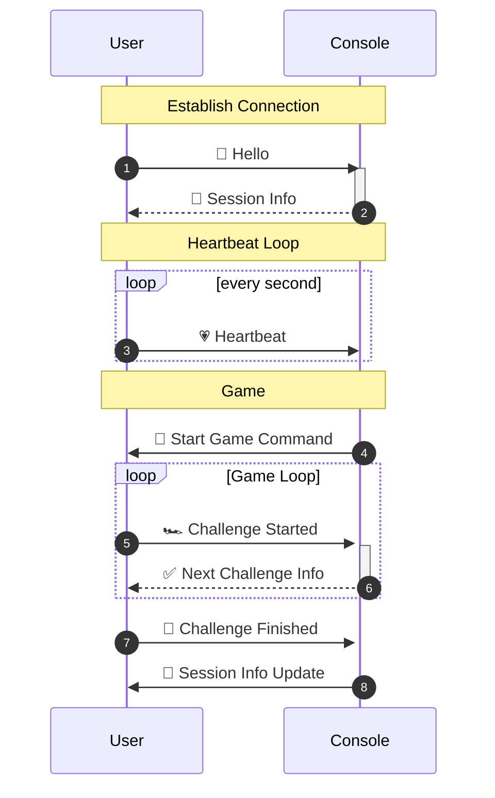

# Communication
## How the Console app communicates with user devices

## Establishing Connection
1. **Hello** `Reliable`:
    - Initial connection message and information such as group name.
2. **Session Info**: 
    - Game Location (Academy/Foundation)
    - Host device identifier
    - Beacon Locations (local coordinate space)
    - Origin Coordinates (Lat & Long for the origin point of the area)

## Heartbeat Loop
3. **Heartbeat** `Unreliable`: 
    - Location Information: 
        - Location
        - Accuracy
        - Date
        - Device Heading
    - Current game state
    - Group's identifier

## Game
4. **Start Game Command** `Reliable`: 
    - Start date of game (by default, 3 seconds after the message is sent.)
5. **Challenge Started** `Reliable`:
    - Current challenge
6. **Next Challenge** `Reliable`: 
    - Response to a challenge started message.
    - Next Challenge
    - Next Challenge Position
    - Game administrators manually set the position.
7. **Challenge Finished**: `Reliable`
    - Completed challenge
    - Date
8. **Session Info Update** `Reliable`:
    - Exact same payload as Session Info.
    - Sent whenever beacon location changes/GPS center position changes.
    - Should not/rarely be sent out.

## Reliable vs Unreliable
- Reliable
    - uses TCP
    - Used for any commands that must be sent to the respective devices.
- Unreliable
    - uses UDP
    - Used for any commands that are not that important and could be ignored/sent out of order. 
    - This is mostly reserved for the heartbeat command as, if it gets received out of order, it will just be discarded and the information is non-critical.
