# Communication
## How the Console app communicates with user devices

```mermaid
sequenceDiagram
    autonumber
    participant U as User
    participant C as Console
    
    Note over U, C: Establish Connection
    U->>C: 👋 Hello
    activate C
    C-->>U: 🔑 Session Info
    deactivate C
    
    Note over U, C: Heartbeat Loop
    loop every second
        U->>C: 💗 Heartbeat
        activate C
        C-->>U: 📍 Position Response
        deactivate C
    end
    
    Note over U, C: Game
    C->>U: 🏁 Start Game Command
    
    loop Game Loop
        U->>C: 🏎️ Challenge Started
        activate C
        C-->>U: ✅ Next Challenge Info
        deactivate C
    end
```

## Establishing Connection
1. **Hello**: Initial connection message and information such as group name.
2. **Session Info**: Information about the game session such as the location (Academy/Foundation), host device identifier, and more.

## Heartbeat Loop
3. Heartbeat: 
    - Location Information: 
        - Relative location to beacons with accuracies
        - GPS location with error
        - True heading
    - Current game state
    - Group's identifier
4. Position Response
    - Console returns the user's predicted location based on the information provided.

## Game
5. **Start Game Command**: Indicate the start date of the game, usually 1 second after the message is sent.
6. **Challenge Started**: User sends a message to indicate they started on a challenge. This message provides information about the new challenge.
7. **Next Challenge**: Response to a challenge completion message. This message is intended to provide information about the next challenge and it's location.
    - The next challenge position is calculated by trying to find a location that would avoid collisions with other groups as much as possible, while requiring the group to walk at least 15m.
