# Communication
## How the Console app communicates with user devices

```mermaid
sequenceDiagram
    autonumber
    participant U as User
    participant C as Console
    
    Note over U, C: Establish Connection
    U->>C: 👋 Hello
    activate C
    C-->>U: 🔑 Session Info
    deactivate C
    
    Note over U, C: Heartbeat Loop
    loop every second
        U->>C: 💗 Heartbeat
        activate C
    end
    
    Note over U, C: Game
    C->>U: 🏁 Start Game Command
    
    loop Game Loop
        U->>C: 🏎️ Challenge Started
        activate C
        C-->>U: ✅ Next Challenge Info
        deactivate C
    end
    
    C->>U: 🔑 Session Info Update
```

## Establishing Connection
1. **Hello**: Initial connection message and information such as group name.
2. **Session Info**: 
    - Game Location (Academy/Foundation)
    - Host device identifier
    - Beacon Locations (local coordinate space)
    - Origin Coordinates (Lat & Long for the origin point of the area)

## Heartbeat Loop
3. **Heartbeat**: 
    - Location Information: 
        - Location
        - Accuracy
        - Date
        - Device Heading
    - Current game state
    - Group's identifier

## Game
4. **Start Game Command**: 
    - Start date of game (by default, 3 seconds after the message is sent.)
5. **Challenge Started**:
    - Current challenge
6. **Next Challenge**: 
    - Response to a challenge started message.
    - Next Challenge
    - Next Challenge Position
    - Game administrators manually set the position.
7. **Session Info Update**:
    - Exact same payload as Session Info.
    - Sent whenever beacon location changes/GPS center position changes.
    - Should not/rarely be sent out.
